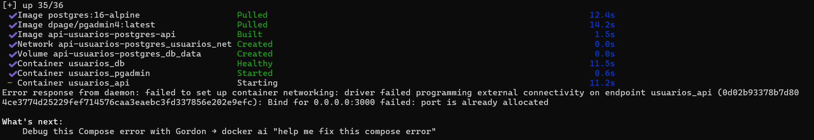
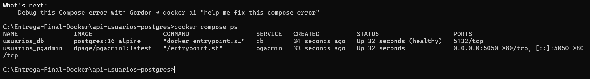
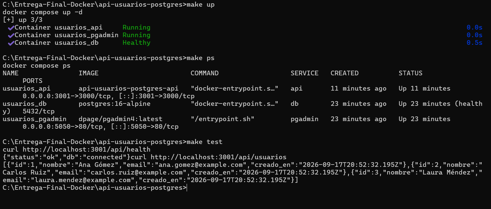
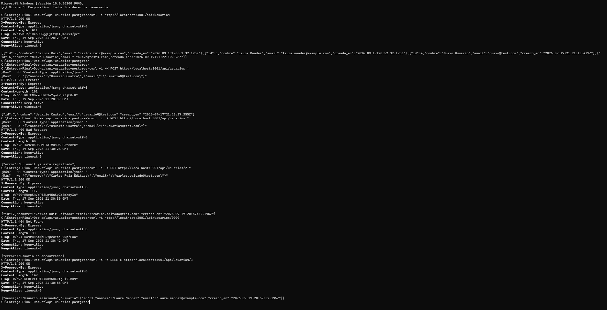
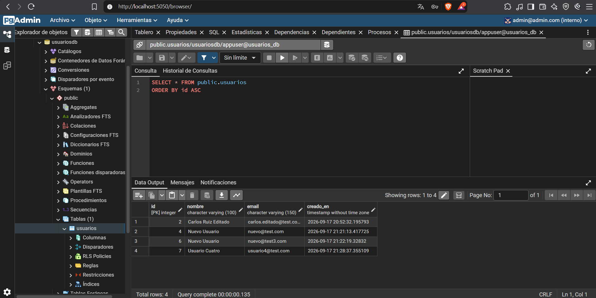

# Proyecto 3 — API REST de Usuarios con Docker

API REST para gestión de usuarios, construida con Node.js (Express) y PostgreSQL, orquestada con Docker Compose. Incluye validaciones, panel de administración de base de datos (pgAdmin) y automatización de tareas comunes mediante Makefile.

## Estructura del proyecto

```
proyecto3-api-usuarios/
├── api/
│   ├── src/
│   │   └── index.js
│   ├── package.json
│   ├── Dockerfile
│   └── .dockerignore
├── db/
│   └── init.sql
├── docker-compose.yml
├── .env.example
├── Makefile
├── evidencias/
└── README.md
```

## Requisitos

- [Docker](https://www.docker.com/) y Docker Compose
- (Opcional) `make` — en Windows: `winget install ezwinports.make`

## Configuración

1. Copia el archivo de variables de entorno de ejemplo:
```
   cp .env.example .env
```
2. Completa los valores en `.env` (usuario, contraseña de la base de datos, credenciales de pgAdmin, etc.).

> **Nota sobre el puerto:** la API se expone en el puerto definido por `API_PORT` en el `.env` (por defecto `3000`). Si ese puerto está ocupado en tu máquina, simplemente cámbialo por otro libre (por ejemplo `3001`) — no requiere modificar el código ni el `docker-compose.yml`.

## Uso

Con Makefile:

| Comando      | Descripción                                   |
|--------------|------------------------------------------------|
| `make up`    | Levanta los tres servicios (API, DB, pgAdmin)  |
| `make down`  | Detiene los servicios                          |
| `make logs`  | Muestra los logs de la API en vivo             |
| `make ps`    | Lista el estado de los contenedores            |
| `make test`  | Prueba los endpoints de health y usuarios      |
| `make clean` | Detiene los servicios y borra los volúmenes    |

Sin Makefile, con Docker Compose directamente:
```
docker compose up -d
docker compose ps
docker compose down
```

## Servicios

| Servicio | Descripción                          | Puerto (host)         |
|----------|----------------------------------------|------------------------|
| `api`    | API REST de usuarios (Node.js/Express) | `API_PORT` (.env)      |
| `db`     | Base de datos PostgreSQL               | interno (red Docker)   |
| `pgadmin`| Administración web de PostgreSQL       | `PGADMIN_PORT` (.env)  |

Para conectar pgAdmin a la base de datos, usa como *host* el nombre del servicio (`db`), no `localhost`, ya que ambos contenedores se comunican dentro de la red interna de Docker.

## Endpoints

Base URL: `http://localhost:<API_PORT>/api`

| Método | Ruta             | Descripción                    | Body de ejemplo                                              |
|--------|------------------|---------------------------------|---------------------------------------------------------------|
| GET    | `/usuarios`      | Lista todos los usuarios        | —                                                               |
| GET    | `/usuarios/:id`  | Obtiene un usuario por id       | —                                                               |
| POST   | `/usuarios`      | Crea un usuario nuevo           | `{"nombre": "Ana Gómez", "email": "ana@example.com"}`          |
| PUT    | `/usuarios/:id`  | Reemplaza un usuario existente  | `{"nombre": "Ana Gómez", "email": "ana@example.com"}`          |
| DELETE | `/usuarios/:id`  | Elimina un usuario              | —                                                               |
| GET    | `/health`        | Verifica que la API esté activa | —                                                               |

**Validaciones:**
- `nombre` y `email` son obligatorios en `POST` y `PUT` (reemplazo completo).
- El `email` debe ser único; si ya existe, se responde `400 Bad Request`.
- Si el `id` no existe, `GET`, `PUT` o `DELETE` responden `404 Not Found`.

## Evidencias

## Levantamiento del compose

## Lista y muestra el estado de los contenedores

## Makefile

## CRUD en funcionamiento (Terminal)

## Verificacion de datos en Postgres


## Preguntas de reflexión

**¿Por qué el script de migración solo se ejecuta la primera vez que se crea el volumen? ¿Qué pasa si quieres volver a ejecutarlo?**
Postgres solo corre los scripts de `/docker-entrypoint-initdb.d/` cuando el volumen de datos (`db_data`) está vacío, es decir, en la primera inicialización. Si el volumen ya tiene datos, Postgres asume que la base ya está inicializada y los ignora. Para forzar que se vuelva a ejecutar hay que eliminar el volumen (`docker compose down -v`, o el objetivo `make clean`) y levantar de nuevo — lo que también borra todos los datos existentes.

**¿Por qué en pgAdmin el host de conexión es el nombre del servicio y no `localhost`?**
Porque pgAdmin corre en su propio contenedor, dentro de la red interna de Docker (`usuarios_net`). `localhost` desde dentro de ese contenedor apuntaría al propio contenedor de pgAdmin, no al de la base de datos. Docker Compose crea una red donde cada servicio es alcanzable por los demás usando su nombre como hostname (resolución DNS interna), por eso el host correcto es `db`.

**¿Qué ocurre si la API arranca antes de que la base de datos esté lista, y cómo lo previene la configuración del compose?**
Si la API intenta conectarse antes de que Postgres esté aceptando conexiones, la conexión falla y la API puede caerse o quedar en un estado inconsistente. Esto se previene con el `healthcheck` de `db` (usando `pg_isready`) combinado con `depends_on: condition: service_healthy` en `api`: Compose no inicia el contenedor de la API hasta que el healthcheck de la base de datos reporte éxito, no solo hasta que el contenedor esté "corriendo".
## Autor
Ismael Mira Correa — Ficha 3229209, SENA/CTMA